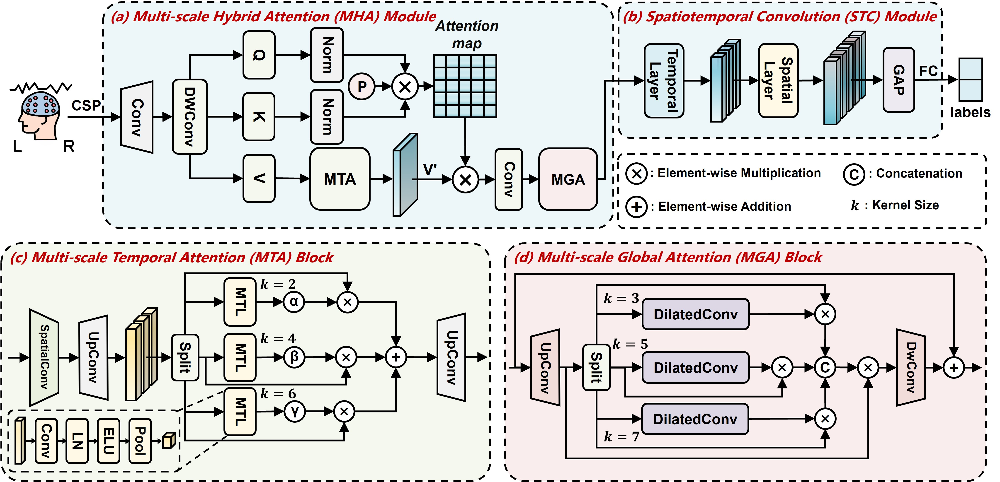

# MHANet

# Code for paper: MHANet: Multi-scale Hybrid Attention Network for Auditory Attention Detection
A novel AAD network, named MHANet, is proposed in this paper. This architecture combines multi-scale temporal features and spatial distribution features to capture long-short range spatiotemporal dependencies simultaneously. It achieves SOTA decoding accuracy within an extremely short 0.1-second decision window on the KUL dataset, with an accuracy of 95.6%. It outperforms the best model by 6.4%. Moreover, our model displays high efficiency, needing only 0.02 M training parameters, which is 3 times fewer than those required by the most advanced model.

Lu Li, Cunhang Fan, Hongyu Zhang, Jingjing Zhang, Xiaoke Yang, Jian Zhou, Zhao Lv. MHANet: Multi-scale Hybrid Attention Network for Auditory Attention Detection. In IJCAI 2025.

# Preprocess
* Please download the AAD dataset for training.
* The public [KUL dataset](https://zenodo.org/records/4004271), [DTU dataset](https://zenodo.org/record/1199011#.Yx6eHKRBxPa) and [AVED dataset](https://iiphci.ahu.edu.cn/toAuditoryAttention) are used in this paper.

# Requirements
+ Python3.12 \
`pip install -r requirements.txt`

# Run
* Modifying the Run Settings in `config.py`
* Using main.py to train and test the model
